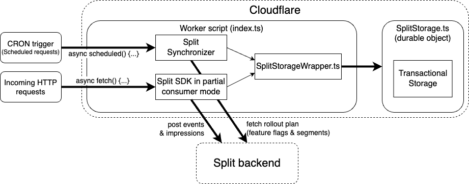

# Cloudflare Workers example using Durable Objects and Split SDK

Based on [Durable Objects TypeScript Rollup ES Modules template](https://github.com/cloudflare/durable-objects-typescript-rollup-esm), this is a NPM package template for kick starting a [Cloudflare Worker project](https://developers.cloudflare.com/workers/) using [Split SDK](https://help.split.io/hc/en-us/articles/360058730852-Browser-SDK) with [Durable Objects](https://developers.cloudflare.com/workers/learning/using-durable-objects).

## Overview

The project overall architecture is ilustrated in the following diagram:

<p align="center">
  
</p>

It has the following modules:

- `src/SplitStorage.ts`: durable object class that will be used as a low-latency consistent storage for your rollout plans (i.e., splits and segments definitions).
- `src/index.ts`: entrypoint of your Worker script, where we handle incoming HTTP requests and scheduled requests.
  - Incoming HTTP requests (see [FetchEvent](https://developers.cloudflare.com/workers/runtime-apis/fetch-event)): these are external requests for which we provide some logic. Here the Split SDK is instantiated in "partial consumer" mode (see [consumer modes](https://help.split.io/hc/en-us/articles/360058730852-Browser-SDK#advanced-consumer-mode)). In this mode, features are evaluated by reading the rollout plan from the `SplitStorage` durable object instead of fetching it from Split backend. But unlike "consumer" mode, the SDK posts impressions and events directly to Split backend instead of storing them.
  - Scheduled requests (see [ScheduledEvent](https://developers.cloudflare.com/workers/runtime-apis/scheduled-event)): these are requests scheduled by a CRON trigger, to execute the Split Javascript synchronizer periodically in order to check if there are new changes in your rollout plan and update the `SplitStorage` if required.
- `src/SplitStorageWrapper.ts`: adapter used by both the Split SDK and Synchronizer to read and write data from a given `SplitStorage` instance.

## Setup

1. Install [Wrangler CLI](https://developers.cloudflare.com/workers/cli-wrangler):

```bash
npm install -g @cloudflare/wrangler
```

2. Scaffold a Cloudflare Workers project from this GitHub repository:

```bash
wrangler generate [your-project-name] https://github.com/splitio/cloudflare-workers-template
```

3. Run `npm install` to install dependencies.

4. Update your `account_id` in the `wrangler.toml` file. You can get it from the Cloudlfare dashboard or running `wrangler dev`.

5. Update your `apiKey` in `src/index.ts` with your Split server-side API key. You can get it from the [Split Web console](https://help.split.io/hc/en-us/articles/360019916211-API-keys).

6. Deploy your worker, locally with `wrangler dev` or in Cloudflare with `wrangler publish`.

### Testing your deployment

To test your deployment, first synchronize the Split Storage with the data of your rollout plan (splits and segments definitions). For that, either wait the CRON trigger to execute, or manually perform a requests to `/sync` to instruct the worker to synchronize data.

```bash
curl 'https://<YOUR-WORKER-DOMAIN>/sync'
// Synchronization success
```

Then you can send a request to `/get-treatment`, which simply evaluates a given split with a given user key, provided as query params, and returns a treatment.

```bash
curl 'https://<YOUR-WORKER-DOMAIN>/get-treatment?key=<SOME-USER-ID>&split=<SOME-SPLIT-NAME>'
// Treatment: on
```
